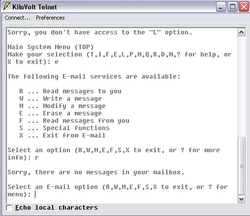



## Kilovolt Telnet

### Description

*** UPDATED *** now fixed "runtime when not conected" bug.

Kilovolt Telnet - A simple VT/100 telnet application with options! Better than Win95/98 Telnet. If you like it please vote for me!
 
### More Info
 
Uses Winsock control

             |
---                |---
**Submitted On**   |2002-06-10 16:56:42
**By**             |[Rowan Ingvar Wilson](https://github.com/Planet-Source-Code/PSCIndex/blob/master/ByAuthor/rowan-ingvar-wilson.md)
**Level**          |Intermediate
**User Rating**    |3.7 (11 globes from 3 users)
**Compatibility**  |VB 6\.0
**Category**       |[Internet/ HTML](https://github.com/Planet-Source-Code/PSCIndex/blob/master/ByCategory/internet-html__1-34.md)
**World**          |[Visual Basic](https://github.com/Planet-Source-Code/PSCIndex/blob/master/ByWorld/visual-basic.md)
**Archive File**   |[Kilovolt\_T925086102002\.zip](https://github.com/Planet-Source-Code/rowan-ingvar-wilson-kilovolt-telnet__1-35668/archive/master.zip)

